# PortalCraft screenshot gallery

Development screenshots from **PortalCraft**, a mod for **Portal (2007)**.

> [!WARNING]
> **PortalCraft is still very buggy and unfinished, and many features remain unimplemented.** These screenshots span development builds and may differ from the downloadable October 8, 2026 build. A feature appearing in a screenshot does not mean it is complete or reliable.

[Back to PortalCraft](../../README.md) · [Download the experimental build](https://github.com/ReVoTheDestroyer/PortalCraft/releases/tag/2026-10-08) · [Watch gameplay clips](../../README.md#gameplay-showcase)

Click an image to view it full size.

## Portals at night

[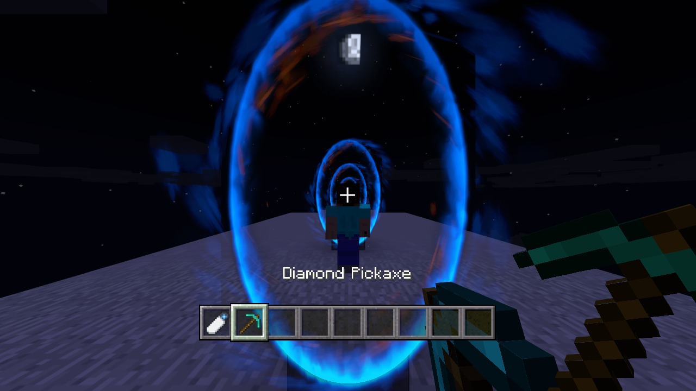](recursive-portals-at-night.jpg)

## Portals in a block world

[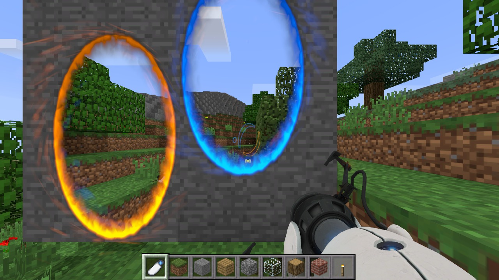](portals-in-block-world.jpg)

## Jungle

[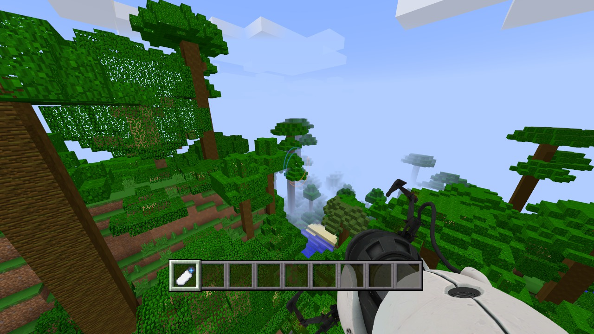](jungle-canopy-overlook.jpg)

## Village

[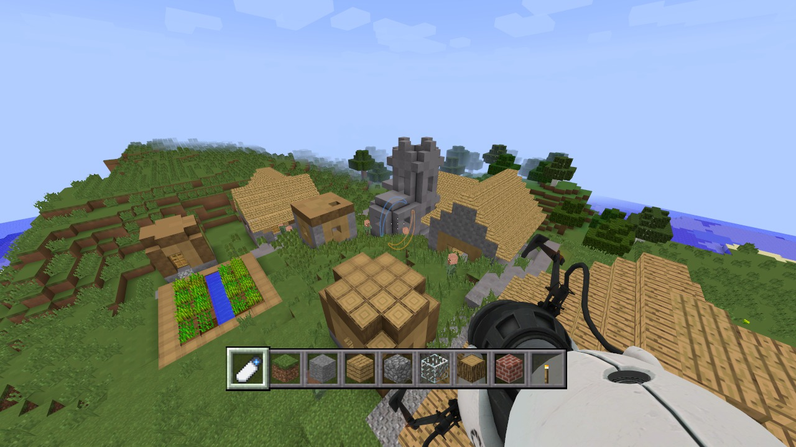](village-overlook.jpg)

## Woodland mansion

[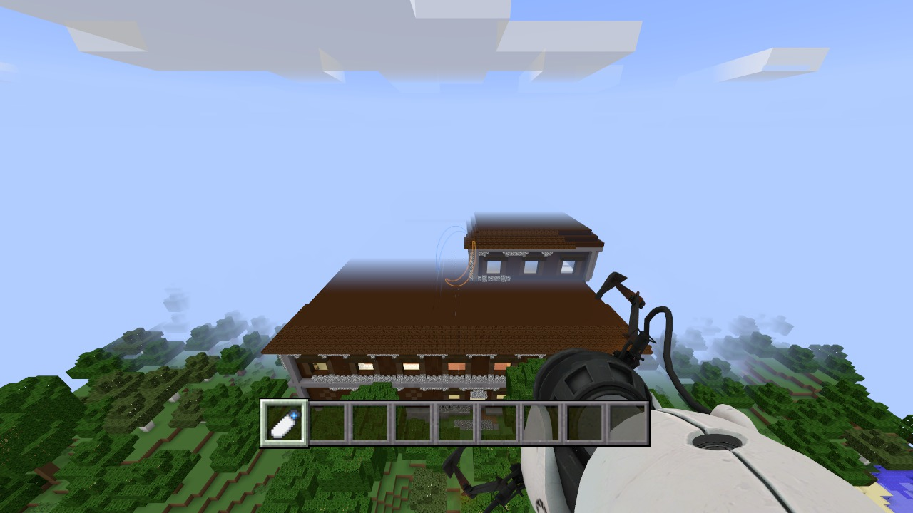](woodland-mansion.jpg)

## Sandstone building

[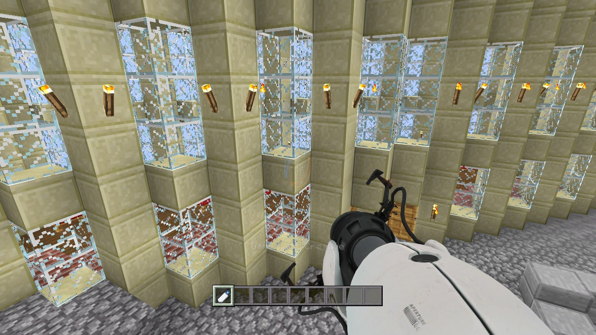](sandstone-and-glass-hall.jpg)

## Hallway

[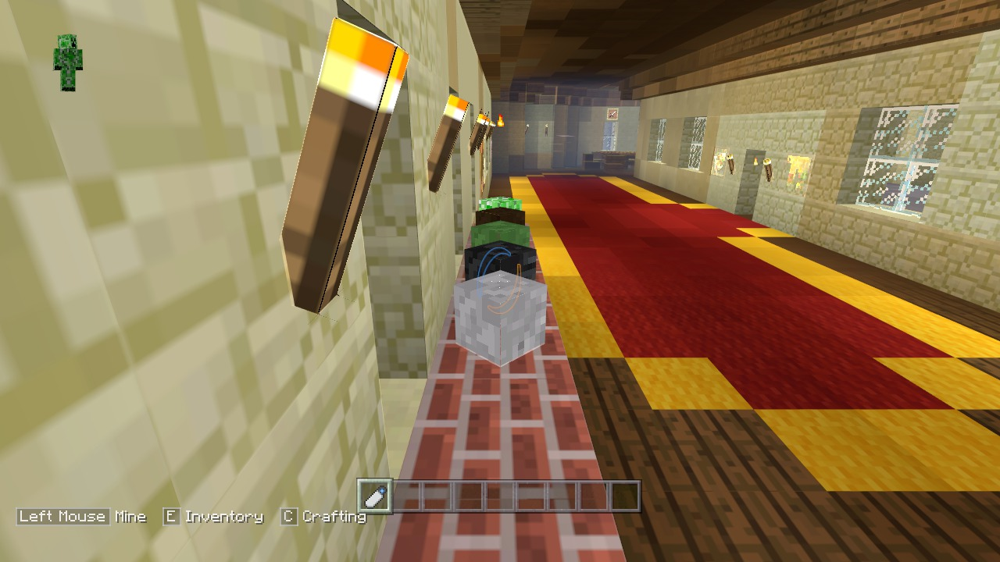](red-and-gold-hall.jpg)

## Stone arches

[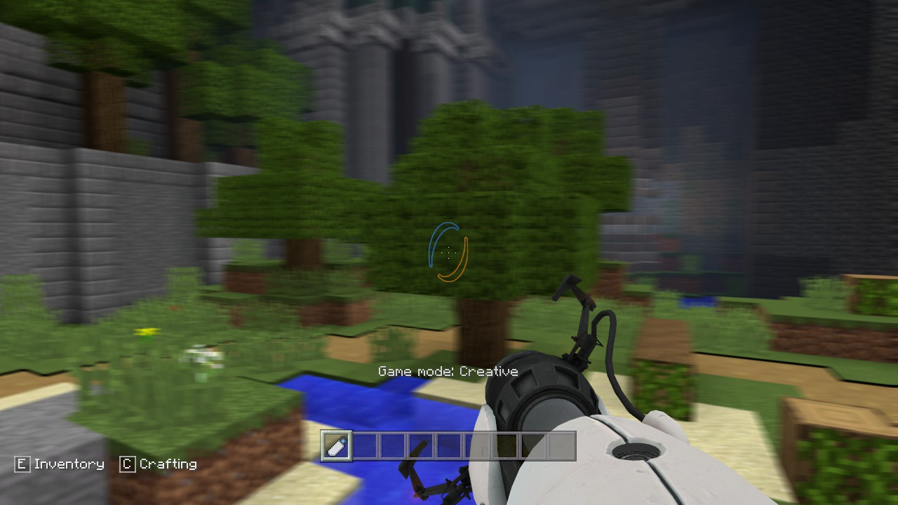](towering-stone-arches.jpg)

## Mountain

[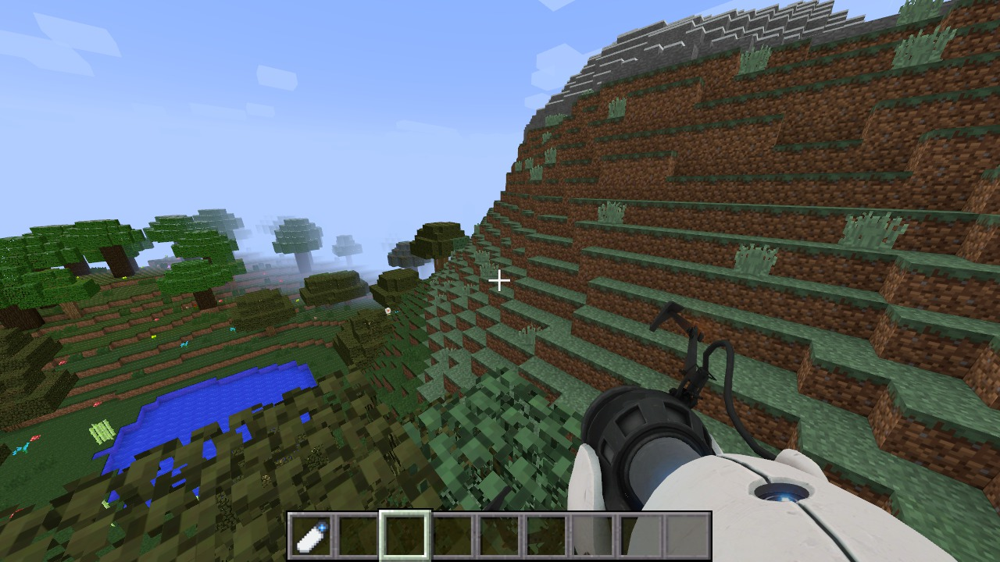](mountain-and-valley.jpg)

## Sunset

[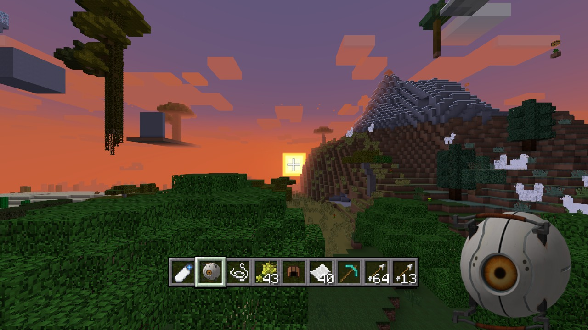](sunset-with-personality-core.jpg)

## Ender Dragon

[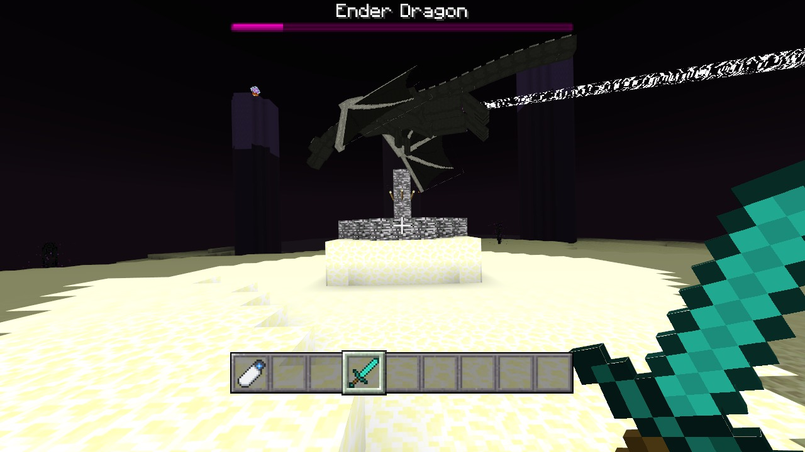](ender-dragon-close-encounter.jpg)

## Ender Dragon death effect

[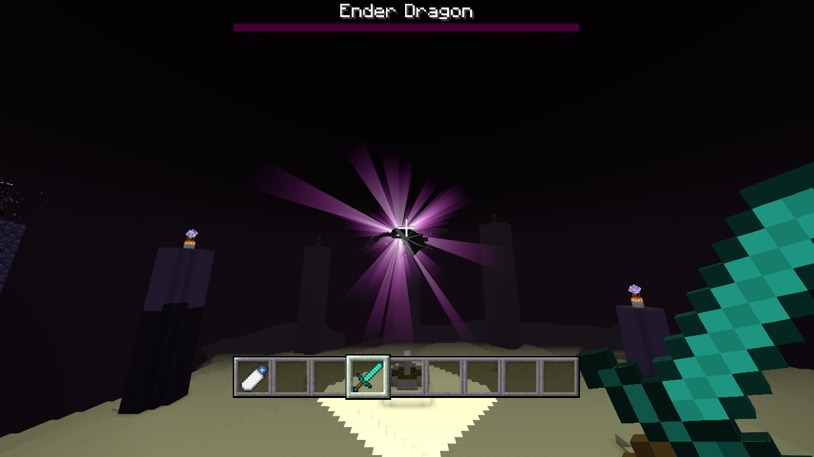](ender-dragon-purple-burst.jpg)

