# PortalCraft screenshot gallery

Development screenshots of **PortalCraft**, an experimental Minecraft-style mod for **Portal (2007)** in Valve’s Source engine.

> [!WARNING]
> **PortalCraft is still very buggy and unfinished, and many features remain unimplemented.** These screenshots span development builds and may differ from the downloadable October 8, 2026 build. A feature appearing in a screenshot does not mean it is complete or reliable.

[Back to PortalCraft](../../README.md) · [Download the experimental build](https://github.com/ReVoTheDestroyer/PortalCraft/releases/tag/2026-10-08) · [Watch gameplay clips](../../README.md#gameplay-showcase)

Select any image to open it at full size.

## Portals and test chambers

### Portals in a block world

Blue and orange portals on a stone wall, with grassy terrain visible through them.

### Back in the test chamber

A Companion Cube in a Portal test chamber, with the Minecraft-style hotbar visible.

[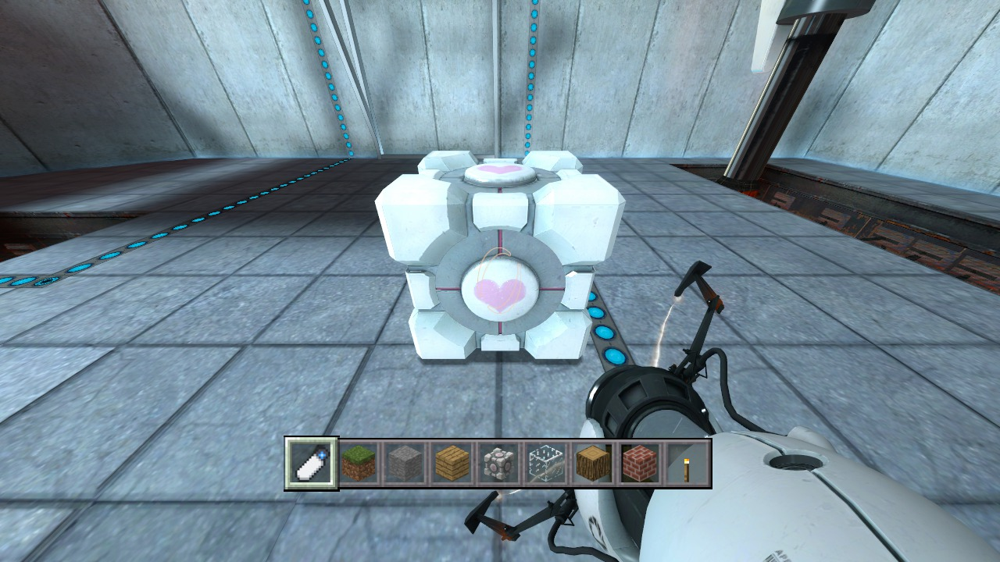](companion-cube-test-chamber.jpg)

### A Companion Cube and two portals

A Companion Cube selected beside blue and orange portals in a block-built test area.

[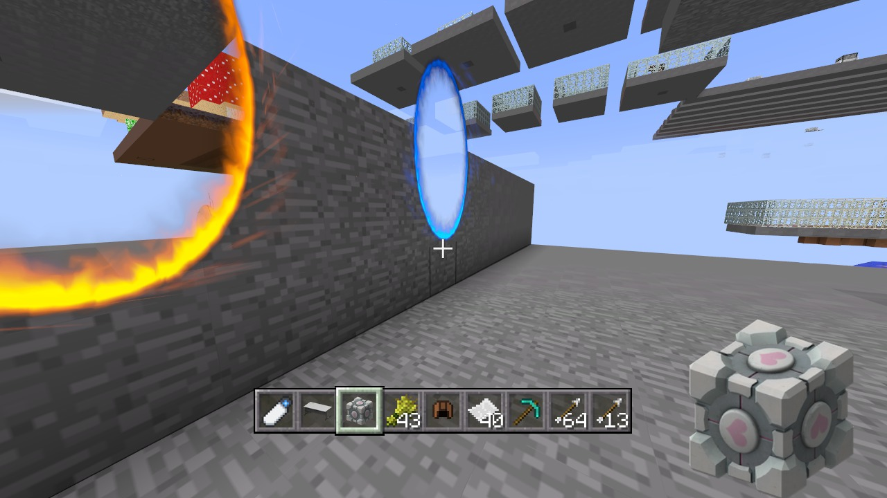](companion-cube-and-portals.jpg)

## Worlds and landscapes

### Village overlook

Houses, crops, and a stone tower viewed from above with the portal gun.

### Jungle landscape

Tall jungle trees and dense foliage with the portal gun equipped.

[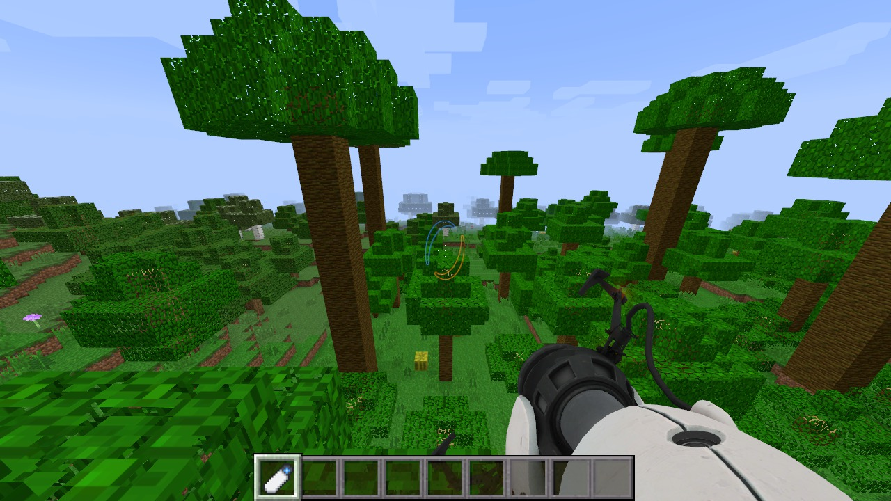](jungle-landscape.jpg)

### Mesa landscape

Layered orange terrain, cacti, and dead bushes.

[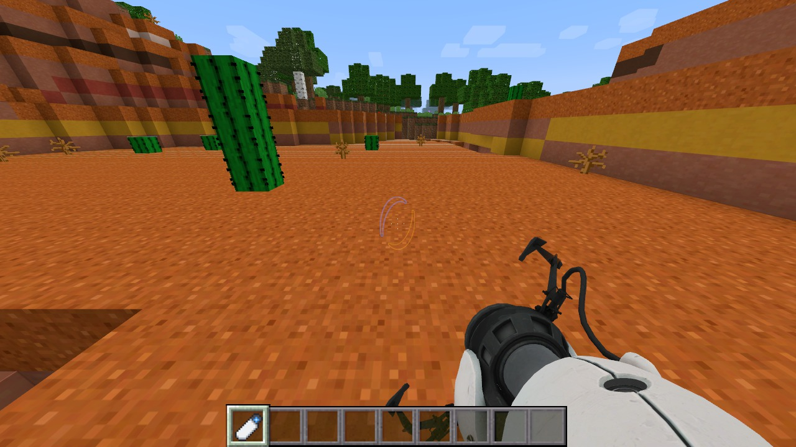](mesa-landscape.jpg)

### Woodland mansion

A large woodland mansion rising above the surrounding forest.

### Mountain and valley

A steep grassy mountain above a wooded valley and pond.

### Snowy forest

Snow-covered ground and spruce trees with the portal gun equipped.

[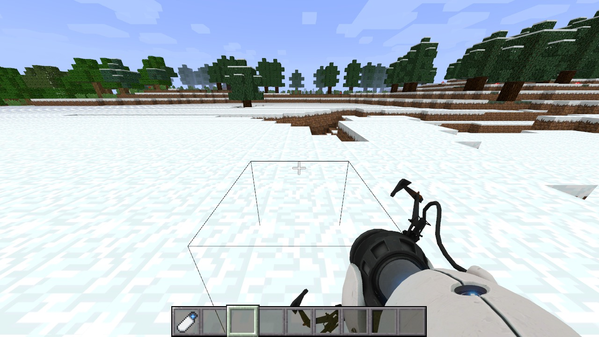](snowy-forest.jpg)

### Above the snowy canopy

A snowy forest canopy seen from above.

[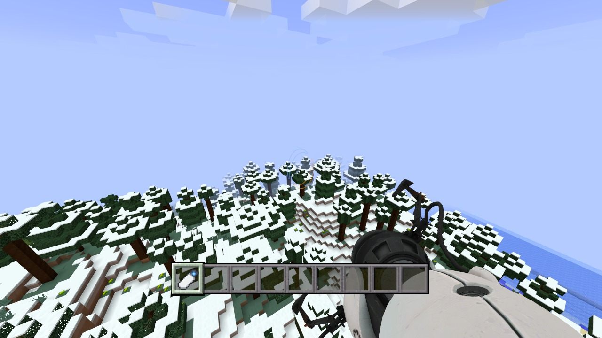](snowy-canopy.jpg)

### Hillside overlook

The portal gun overlooking blocky hills, trees, and water.

[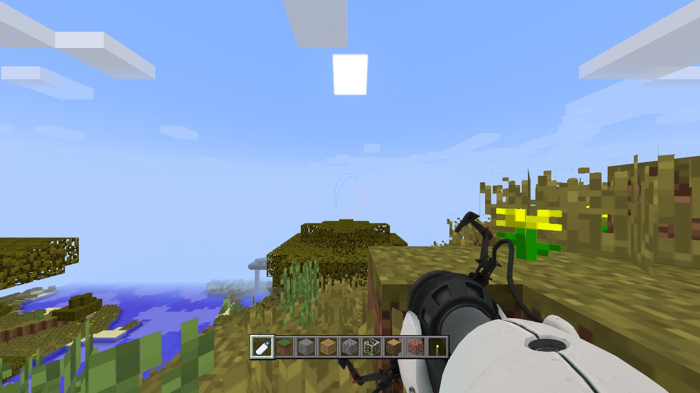](hillside-overlook.jpg)

### A valley with a wooden build

A small wooden structure among grassy terraces, trees, and stone cliffs.

[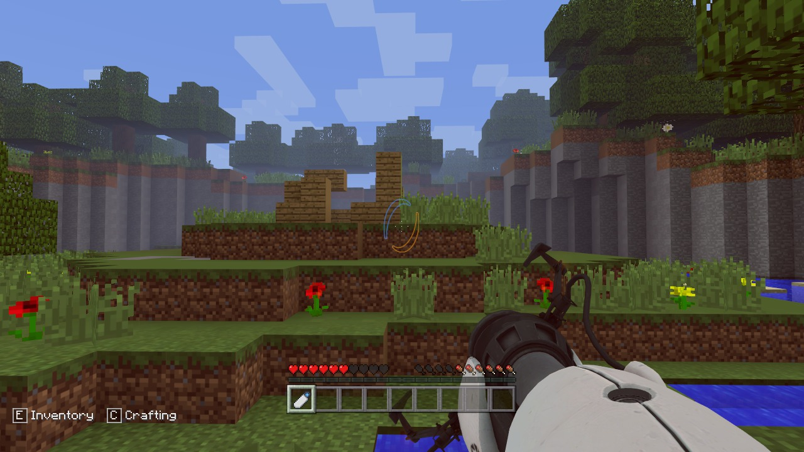](tutorial-valley.jpg)

## Building details

### Bookshelves and an enchanting table

An enchanting table surrounded by bookshelves, viewed with the portal gun.

[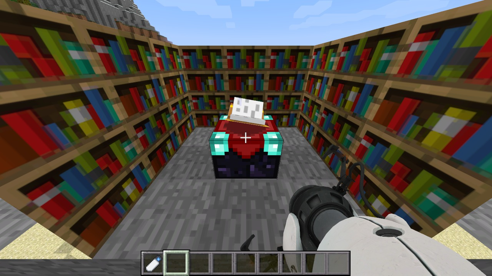](enchanting-room.jpg)

### Crops and item frames

Rows of crops marked by item frames and lit by torches.

[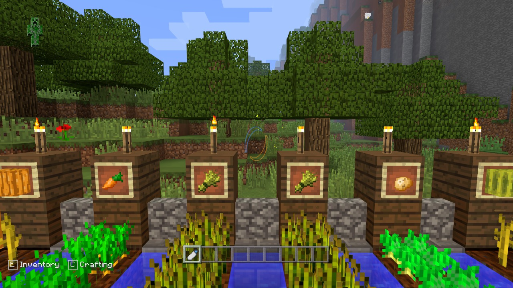](crops-and-item-frames.jpg)

## Other worlds

### Nether cavern

Red, blocky cavern terrain viewed with flint and steel selected.

[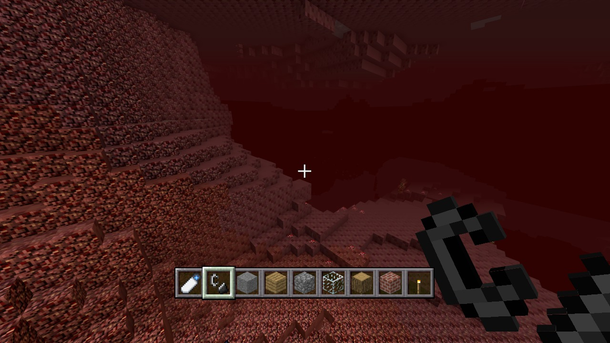](nether-cavern.jpg)

### The End

An Ender Dragon above the central structure, with obsidian pillars and Endermen nearby.

[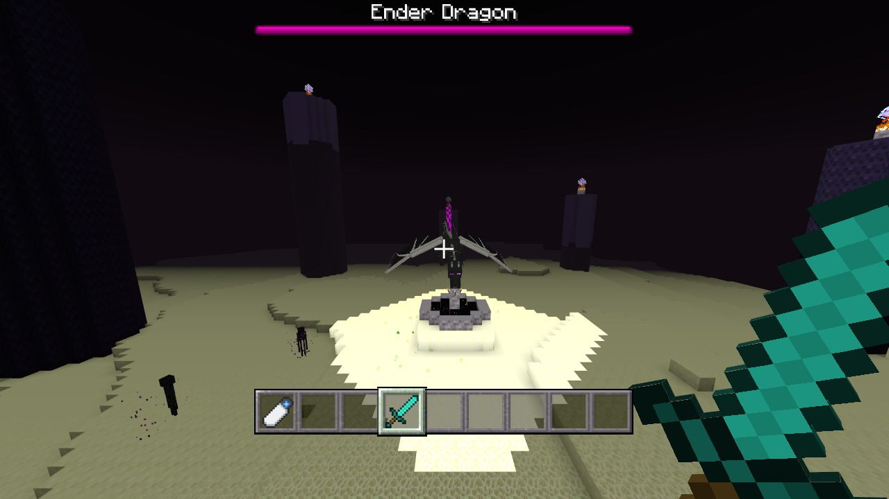](ender-dragon.jpg)
